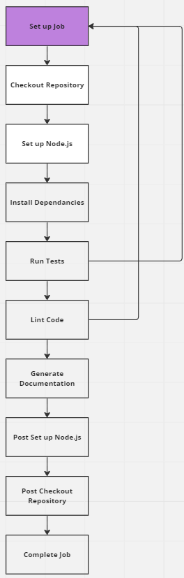

# CI/CD Pipeline Status Update - G10

## Current Status - Phase 1

As of 05/21/23, our CI/CD pipeline is integrated into GitHub actions. With the steps listed in order as given, we currently have the YAML file set up to:

* Checkout the Repository
* Set up Node.js
* Install Dependencies
* Run Tests
* Lint Code
* Generate Documentation

##  Currently Functional:

Our pipeline is established and set up in GitHub actions. The template code in each step currently gives us a baseline to operate from as we integrate our desired features into our project. The pipeline will focus on ensuring that we have properly styled code, enough documentation (for someone reading the code for the first time) and whether the newly added features pass all common unit tests. If any of these fail, the linter will raise error causing the assigned developer to change their code. We also added a rule to ensure that every pull-request requires a minimum of two reviews before merging.

## Next Phase Plans

We plan to integrate user tests from each team member, and include the linter Prettier.io (as a workflow) in our project. For the time being, our workflow is setup on our magic 8ball project with pre-determined tests, but future iterations will require every developer to add their own test cases for any new feature along with a set of pre-determined unit tests being run to enure code quality. We will also try to work with a Github action to ensure that all commit messages being passed actually mke sense and are descriptive. 

## CI/CD Diagram

