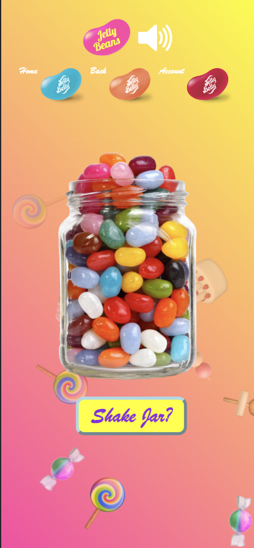

## Sprint 2 Review

# Attendance

- James
- Hamza
- Matthew
- Kian
- Austin
- Mohak
- Joshua
- Neil
- Bill

# Bill, Neil, Hamza

Worked on the fortune page, where we added more jellybeans with, a total of 15, that gets randomly chosen. The jellybeans are now chosen 3 at a time, rather than 5 at a time. We also added an animation to each of the jellybeans. Neil programmed the main function of the animation - where the jellybeans bounce around the screen and edited the back button jellybean on the navigation bar. Hamza worked on the fine tuning the animation with adjusting animation function by finding the pixel offset to match the website in a user friendly way. Bill added more jellybeas that can be chosen randomly, by making a function that chooses 3 jellybeans out of the 15 jellybeans. He also added fortunes to each jellybean by giving each jellybean an assigned catagory. For example, the Green Jellybean for prosperity and abundance, the Blue Jellybean is for serenity and calmness, etc.

# Kian, Matthew

Added shinking and opacity change animations to fortune generation page. Also added sequential text generation for the fortune text. Added canned fortune responses correspoding to the color of each jellybean. Upon clicking a jellybean, all other jellybeans will shrink and have reduced opacity. Also, the user has an option to click on the same jellybean twice to return it to its normal size and reset the size and opacity for all jellybeans. Added test cases for these features, checking if the opacity changes occur and such.

# Austin, Dennis, Mohak, James

Worked on CI/CD pipeline and procedures; made testing format and conventions as well as added to creative process for web design. Looked at figma files and implemented key css fixes and html restructuring for optimization. Worked on QA for the website; fixed some css errors and looked at current issues on github; also created 3 more issues for buggy and erroneous features. Made testing directory and added unit tests and started looking into E2E testing for the project; talked with Mohak about establishing a testing procedure for CI/CD pipeline.

# Joshua

Created an animated background for the website with floating emojis. The background when loaded will have multiple candy emojis floating across the page. I also made the navigation bar more appealing by making it transperent and fixed an issue where our website was not mobile-friendly. When the screen is resized to having a smaller width, the navigation bar of the website will resize accordingly while still maintaining functionality.

